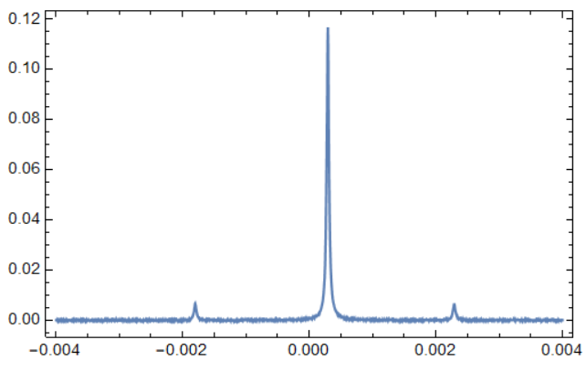

# MathematicaUtilities

An experimental physicist's aid in data analysis using Mathematica.

The core of the package is dedicated to operations on lists of x and y values stored as `{{x1, y1}, {x2, y2}, ...}` – a natural format in which many kinds of experimental and numerical data come to be processed. Such lists are unsurprisingly called `XYLists` throughout the package.

Tested with Mathematica 11.0

## Installation

To use this package, the "utilities.m" file and the "Utilities" folder of this repo should be reachable from the Mathematica `$Path`. 

The simplest way to achieve this is to copy the "Utilities" folder from this repository to the folder with the Mathematica notebook that you would like to use the package from.

Alternatively, to have the package always available right after the Mathematica startup, download the repo locally, e.g. to "C:\\...\\MathematicaUtilities", and add the following command to the initialization file `$UserBaseDirectory`\Kernel\init.m:
```Mathematica
Module[{dirname},
	dirname="C:\\...\\MathematicaUtilities";
	If[!MemberQ[$Path,dirname],PrependTo[$Path,dirname]]
]
```


## Getting started

Suppose that there is a data table – an oscilloscope trace in this example – that is saved in a txt file like this
```
# Time (s) Voltage (V)
-0.010000000 4.396614e-05
-0.009997395 4.396614e-05
...
```
Below there are a few illustrations of what can be done with it using the functions in the package. Loading the package and the trace is done as

```Mathematica
SetDirectory[NotebookDirectory[]];
<< Utilities.m

xylist = Import[".\\Example data\\1. cavity transmission 1.txt", 
    "Table"][[2 ;;]];
```

Plotting the data over a certain range of x values
```Mathematica
ListPlot[SelectRange[data, {-0.004, 0.004}], defaultPlotFrameOptions, 
 PlotRange -> Full, Axes -> False, Joined -> True]
```


Rescaling the data along the x axis and subtracting an offset along the y axis
```Mathematica
ScaleX[ShiftY[data, -0.1], 10^4]
```
(both the scale and the offset can also be `XYList`s, in which case the functions apply their y values, while their x values are assumed to be the same those of `data`).

Peak finding
```Mathematica
FindPeaksXY[xylist, 1, 0, 0.06]
{{0.00029427, 0.11662688377599999}}
```

Area integration under both small peaks
```Mathematica
IntegrateXY[data, {{-0.002, -0.0018}, {0.002, 0.0025}}]
7.14425*10^-7
```

To see help for a function, use `??` command, such as
```Mathematica
?? ScaleX
```

## Overview

The functions that I presonally used most are 

- `ScaleY`, `ScaleX`, `ShiftY` and `ShiftX` can rescale a list of xy data in X and Y directions and shift the origin in a single command. 
 
- `SelectRange` – pick data points which x values belong to a certain range. Also the lower-level function `InRangeQ` that it uses is useful per se.
- `IntegrateXY` – a routine that efficiently integrates y(x) represented as a xy list and nicely handles arbitrary x boundaries and disjoined intervals (say, of x ranging from 1 to 1.5 *and*  2 to 2.5, which is handy for outlier exclusion).
- `Average` – performs a running average of an xy list over x with subsequent downsampling. It takes care to properly center the averaged y value around the downsampled x values.

- `FindLogFit` – the same as `FindFit`, but with the error defined on log scale. Can be used to make fitting more robust.
- `ThreadFindFit` – applies a fitting function over a list of xylists, possibly restricting to the x values within a certain interval.
- `LoadDataSeries` – loads files that have parameters in their name (say "spectrum_power_x_mW.txt") and returns data vs parameter
- Test patterns can be also useful, for example see `FunctionQ` or `XYListQ`.

These functions are typically automatically threaded over lists of xy traces.
 
The plotting package includes:
* definitions of gradient color sets (e.g. `redColors` and `blueColors`) for quickly beautifying plots.
- `ListPlotJ` – a family of functions that plot discrete data points and continuous lines joining them. This is surprisingly annoying to implement using built-in Mathematica functions. 


## Sub-packages

* `DataAnalysis` - Functions operating with lists of `{x, y}` and `{x, y, z}` data, data matching patterns, fitting routines, batch data analysis etc.
* `CellReuse` - Functions for copying Mathematica cells with replacing name tags. Enables reusing once-written code for diffrent input data while keeping all variables simultaneously in the global scope.
* `Plotting` - Color lists, plotting options and a few plotting functions beyond the Mathematica standard catalog. 
* `Fourier` - High-level routines for Discrete Fourier Transforms on `XYList`s. 
* `FemTools` - Function for importing and processing data generated by COMSOL (such as tables with results of parametric sweeps), and integration of data defined over 2D triangular and 3D tetrahedral meshes using interpolation.
 
 ## Applications

For application examples one is invited to have a look at the repos with the data and data processing notebooks for our manuscripts

* [Quantum Correlations of Light from a Room-Temperature Mechanical Oscillator](https://zenodo.org/records/854557)
* [Elastic strain engineering for ultralow mechanical dissipation](https://zenodo.org/records/10927399)
* [Thermal intermodulation noise in cavity-based measurements](https://zenodo.org/records/3747301)
* [Squeezed light from an oscillator measured at the rate of oscillation](https://zenodo.org/records/10927399)

MathematicaUtilities are also used in [Euler-Bernoulli beam](https://zenodo.org/record/1296925#.YVon7ZqxVPY).

## Implementation remarks

Most of the .m packages are not to be edited directly, but using the companion .nb files with
the same name, from which they were generated. Each time the .nb file is saved, .m file is automatically replaced with a 
new one, thus discarding any changes made in the .m file directly. This system is followed because notebooks allow 
reacher formatting and embedding images, which is very useful for illustrating complex mathematical formulas.

Those .m files that do not have associated .nb files with the same name can be edited directly. 


## Acknowledgements

The family of functions MapX.. is adopted from the [Vivishek Sudhir](https://github.com/vivisheksudhir)'s He3Analysis package.
Also a few functions are based on discussions at mathematica.stackexchange.com and stackoverflow.com, with appropriate references in those cases. 
